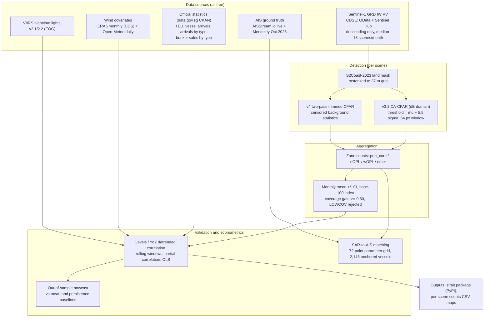

# Sentinel-1 Anchorage Presence as a Leading Economic Indicator: Evidence from the Singapore Strait

**Draft status:** v1 paper draft, 2026-09-05. All quantitative claims trace to the logged experimental record (`experiments/README.md`, iterations 1–28; `autoresearch.jsonl`) and to raw artifacts listed in Appendix B. Negative results are reported as negative results.

---

## Abstract

We test whether vessel presence in Singapore Strait anchorages, measured directly from free Sentinel-1 SAR, tracks official maritime-economic statistics before those statistics are published. A two-pass trimmed CFAR detector over 248 accepted scenes (2016–2026, 237 of them in the analysis-grade 2021–2026 window) produces monthly anchorage counts by zone. Counts in the Eastern OPL (eOPL) anchorage — not total-area-of-interest counts — correlate with monthly bunker sales at Pearson r = +0.73 (n = 57 months, p < 0.001; Spearman ρ = +0.74; re-verified from perscene_join.csv), survive year-over-year detrending (r = +0.46), and are insensitive to wind: the partial correlation controlling for ERA5 monthly wind is +0.696. A satellite-only regression explains R² = 0.478 of bunker-sales variance; adding official tanker arrivals raises this to 0.700. The mechanism is independently confirmed: historical AIS shows the eOPL zone is a tanker anchorage (4,240 unique vessels in October 2023; 77% of anchored reports are tankers), and SAR-to-anchored-AIS matching reaches 84.2% at the precision preset (72-point parameter grid, 2,145 anchored AIS vessels). We report three negative results: an out-of-sample nowcast does not beat a persistence baseline (RMSE 0.104 vs 0.120); the H1-2024 congestion episode shows no anchorage-presence spike (it was a waiting-time event); and an apparent "mega-ship consolidation" trend was shown to be a detector-version artifact and is retracted. The surviving claim is modest and specific: zone-resolved SAR presence is a contemporaneous, weather-insensitive, independently validated indicator of bunkering activity, available ahead of official prints by roughly the reporting lag, but not yet a forecasting instrument.

---

## 1. Problem Statement

Singapore's port economy is large and fast-moving: 41.12M TEU of container throughput, S$1.3 trillion of merchandise trade, and a record 54.92 Mt of bunker sales in 2024, with roughly 90% of container volume being transshipment. Official monthly statistics for these series exist as open data, but arrive with a multi-week reporting lag (2–3 weeks in this project's accounting); the practical value of any satellite proxy is bounded by that lag, not by detection latency.

Three gaps motivate this work:

1. **Timeliness.** Official series (container throughput, vessel arrivals, bunker sales) are published monthly, after the fact. A same-month proxy from radar, which works at night and through cloud, could compress that lag to days.
2. **AIS coverage is not universal.** Terrestrial AIS receiver networks have gaps. In our own live capture, the eOPL anchorage showed zero AIS vessels from one receiver network while SAR consistently detected ~97 bright targets there; a second, historical receiver network recorded 4,240 unique vessels in the same zone in one month. Any AIS-based trade indicator inherits receiver-coverage bias.
3. **Existing trade-from-space pipelines are AIS-based.** The IMF/World Bank nowcasting lineage (Cerdeiro et al. 2020; Arslanalp et al. 2021) derives port activity from AIS positions, not from raw SAR detection. No open, reproducible pipeline existed for SAR-native port-activity indices validated against official statistics — and the SAR-vessel-detection literature itself notes that most published methods have very limited validation (Kanjir et al. 2018).

The question this paper answers is deliberately narrow: **does a CFAR-detected, zone-resolved SAR presence index carry economic signal, and where exactly does it fail?**

---

## 2. Related Work

**Trade and port activity from space.** Cerdeiro, Komáromi, Liu & Sridhar (2020) built the end-to-end nowcasting recipe for the IMF: explicit port polygons, per-day vessel presence from AIS, monthly aggregation, validation against official statistics. We adopt their aggregation discipline (per-scene daily counts, days-observed transparency, base-100 index normalization) but replace AIS with raw SAR detection. Arslanalp, Koepke & Verschuur (2021) applied satellite-derived daily port indicators to Pacific island trade. Verschuur, Koks & Hall (2020, 2022) established that anchorage queue length is the congestion signal during disruptions — the hypothesis behind our H1-2024 case study (which returned a negative result; §4.8).

**SAR vessel detection.** El-Darymli et al. (2013) survey SAR-ATR and establish CFAR front-ends as standard practice; our local μ+kσ detector in the dB domain (k=5.5, 2.4 km window) sits within published norms. Grover, Kumar & Kumar (2018) report that most Sentinel-1 false alarms originate on land — consistent with our experience that land masking dominated detector engineering. Greidanus et al. (2017) describe SUMO, the EMSA operational detector, validating CFAR + VV polarization for operational use. Ai et al. (2021) propose BTS-CFAR (bilateral trimmed-statistics CFAR) for complex ocean scenes; this is the direct precedent for our v4 two-pass trimmed CFAR. Zhou et al. (2026), surveying ~250 papers across fifty years of SAR ATR, identify guard-cell censoring as the key improvement for dense-target scenes — precisely the failure mode our vision QA found in v0/v3.1 (bright ships inflating local background statistics and masking neighbors).

**SAR–AIS fusion.** Rodger & Guida (2020) and Galdelli et al. (2021) fuse SAR and AIS for dark-vessel detection. Our contribution runs the comparison the other way: AIS as ground truth for SAR detection quality (precision-type matching), and SAR as the sensor that sees into receiver gaps.

**Bunkering from vessel behavior.** Feng et al. (2020) estimate bunkering from AIS. Our finding that the eOPL zone is a tanker anchorage (77% of anchored AIS reports are tankers) connects the SAR index directly to this literature.

**Methodological debts.** The `strait` package design follows atlite (PyPSA) — the Cutout abstraction over weather data was transplanted to Sentinel-1 cutouts. Wind as a confound covariate (ERA5) also follows atlite's practice.

---

## 3. Data and Method

### 3.1 Architecture

*Figure 1. Pipeline architecture. Every arrow corresponds to a logged script or analysis (Appendix B).*

### 3.2 Study area, zones, and satellite data

The area of interest is the Singapore Strait, 103.55–104.35°E, 1.05–1.55°N (2400×1500 px at ≈37 m/px). Archive reality, measured rather than assumed (CDSE OData query, 2026-09-04): 352 IW-GRD scenes from 2025-01-04 to 2026-09-03, median 18 scenes/month (max 24, min 2), **all descending** (`1SDV`, VV/VH), provider mix S1A (308) → S1D (44, from 2026-06). No ascending acquisitions exist for this AOI.

Zone rectangles approximate named anchorage areas: `port_core`, `eastern_opl` (eOPL), `western_opl` (wOPL), and `other`. These are approximations — official MPA port-limit polygons were not available as open GIS at v0.1 scope, and this limitation propagates into every zone-level result (§5).

The per-scene series (`perscene_counts.csv`) contains 386 scene records, of which 248 pass the ≥0.80 coverage gate (status OK); 138 are rejected as LOWCOV. The OK scenes split 11 pre-2021 (2016: 1, 2017: 2, 2018: 1, 2019: 1, 2020: 6) and 237 in 2021–2026 (2021: 61, 2022: 54, 2023: 4, 2024: 49, 2025: 55, 2026: 14). Pre-2021 history is sparse because the CDSE long-term archive throttles recall of older scenes; the analysis-grade window is 2021–2026. (Bookkeeping note: the run-6 log header records "243 accepted scenes (2021-2026)" while the CSV holds 237 OK scenes in 2021–2026 plus 6 in 2020; the discrepancy is unresolved in the log and flagged in Open Questions.)

### 3.3 Land mask

The v3.1 monthly pipeline used a temporal-median land mask (median > −12 dB + dilation), ≈55% land. This was replaced by S2Coast-2023 (Sentinel-2-derived global high-water-line coastline, validated RMSE 17.4 m), rasterized from the Zenodo shapefile to the project grid: 49.7% land. The difference matters: the temporal median over-classified bright ships and shore infrastructure as land. S2Coast also removed a dependency cycle (the median mask required monthly composites, which were quota-blocked).

### 3.4 Vessel detection

**v3.1 CA-CFAR (dB domain).** A pixel with intensity $x$ (dB) is a candidate if

$$
x \;>\; T = \max\!\big(\mu_B + k\,\sigma_B,\; -12\ \mathrm{dB}\big), \qquad k = 5.5,
$$

where $\mu_B, \sigma_B$ are the local mean and standard deviation over a 64 px (≈2.4 km) window, computed with land pixels filled by the global sea median (a neutral fill; earlier fill choices are a documented failure mode, §4.1). Candidates become detections via connected components with a 3-pixel minimum, and components larger than 25 px are **peak-split** so that dense anchored queues and azimuth-smeared "comet" movers are counted ship-by-ship.

**v4 trimmed (censored) CFAR.** In dense anchorages, ships inside the estimation window inflate $\mu_B$ and $\sigma_B$, raising the local threshold and suppressing neighboring detections — the exact miss found by vision QA. The fix follows the censored-statistics literature (Ai et al. 2021; guard-cell censoring per Zhou et al. 2026). Pass 1 computes a provisional global threshold from robust statistics,

$$
t_0 = \operatorname{median}(W) + K \cdot \mathrm{MAD}(W),
$$

pass 2 recomputes the local background only from sea-only pixels below $t_0$,

$$
B = \{\, x \in W : x < t_0 \,\}, \qquad T = \tilde{\mu}_B + k\,\tilde{\sigma}_B,
$$

purely adaptive, with no absolute floor. On five OData test crops this raised detections from a mean of 558 (v3.1) to 1,441 (v4), a mean improvement of **+159%** (§4.1, Table 3).

### 3.5 Aggregation

Per-scene zone counts are aggregated to monthly means with confidence intervals and a base-100 index (base = first 12 months), following the Cerdeiro et al. (2020) recipe, with days-observed ($n$) transparency per month. Instantaneous presence is a **stock**; official throughput series are **flows** — the join is between a stock index and flow levels, which is why detrended and rank statistics carry the interpretive weight below.

### 3.6 Economic, weather, and night-lights covariates

- **Official series** (data.gov.sg CKAN, IDs in Appendix A): container throughput (TEU), vessel arrivals total and by type, bunker sales by type (377–6,032 rows depending on series). SingStat merchandise trade was inaccessible via CKAN at v0.1 (HTTP 403) and is left for v1.
- **Wind.** ERA5 monthly mean wind, 132 months (2015-01–2025-12), 3×5 grid at 0.25°, via Copernicus CDS; and Open-Meteo daily maxima, 4,261 daily records → 140 monthly aggregates (2015-01–2026-08). The two capture different things: ERA5 mean wind tracks the monsoon/trade pattern; Open-Meteo daily maxima track weather extremes.
- **VIIRS nighttime lights (VNL v2.1/v2.2, EOG)**, annual, 2015/2018/2021/2023 — an independent economic-activity proxy (port and refinery lighting).

### 3.7 AIS ground truth

- **Live:** AISStream.io WebSocket, 5-minute capture: 106 unique MMSI, 96 with positions, 63 anchored.
- **Historical:** Mendeley "AIS Data from 11 ports around the globe", Singapore, October 2023, 610K records.
- **Parameter optimization:** 72-combination grid (k × window × min-pixels) scored against 2,145 unique anchored AIS vessels (iteration 28).

### 3.8 Econometric analysis

Levels correlations use Pearson $r$ and Spearman $\rho$; detrending uses year-over-year (YoY) log-differences and 3-month moving averages of YoY (MA3-YoY). Weather confounding is addressed with the partial correlation

$$
r_{XY \cdot W} = \frac{r_{XY} - r_{XW}\, r_{YW}}{\sqrt{(1 - r_{XW}^2)(1 - r_{YW}^2)}} ,
$$

with $X$ = eOPL index, $Y$ = bunker sales, $W$ = wind. Nowcast skill is measured against baselines by

$$
\mathrm{skill} = 1 - \frac{\mathrm{RMSE}_{\text{model}}}{\mathrm{RMSE}_{\text{baseline}}} ,
$$

with baselines being the unconditional mean and persistence (last month's YoY change), evaluated strictly out-of-sample.

### 3.9 Reproducibility

The pipeline is packaged as `strait` (PyPI: `strait-observatory` 0.1.0; 36 tests passing; CI on Python 3.10–3.12), with a five-line API (`Cutout.prepare()` → `detect()` → `aggregate()` → AIS validation) modeled on atlite. The data-download layer is stubbed and points at the observatory scripts — the package is a reproducible analysis harness, not yet a one-command data product.

---

## 4. Evidence

### 4.1 Detector engineering: what failed and why

The detector went through five versions; the failure log is retained deliberately because each failure mode is a transferable lesson.

| Version | Outcome | Root cause / lesson |
|---|---|---|
| v0 | Merged queues silently dropped by a 600 px component cap (Sept eOPL queue: ≥10 ships → 3 detections) | never cap component size without splitting |
| v2 | Invalid: 11.4k "ships" in one month | min-filter background poisoned by a −40 dB land fill |
| v2.1/2.2 | 0 ships | global z-score on a systematically positive anomaly; one NaN pixel poisoned medians |
| v3 | stable but under-detecting near coast | 0 dB fill biased local thresholds; diagnosed by same-math A/B (6,142 vs 2,755 candidate pixels) |
| **v3.1** | frozen; stable 254–409 detections/month on monthly composites | neutral fill (global sea median) |

Vision QA (two rounds, independent reviewer model) caught the v0 queue miss (round 1: ACCEPT-WITH-FIXES) and passed v3.1 on the September scene (10–12 markers on the queue), with one residual concern on a dim, perfectly regular ~60–100-speck grid in the northeast — consistent with fixed aquaculture/mooring rafts, i.e. plausibly correct exclusion.

The trimmed-CFAR upgrade (v4), motivated by this QA finding and the censored-statistics literature, on five single-image OData crops:

| Crop | v3.1 detections | v4 detections | Improvement |
|---|---|---|---|
| 2016-08 | 551 | 1,289 | +134% |
| 2017-09 | 565 | 1,342 | +138% |
| 2017-06-15 | 522 | 1,390 | +166% |
| 2018-09 | 550 | 1,644 | +199% |
| 2026-xx | 601 | 1,538 | +156% |
| **mean** | **558** | **1,441** | **+159%** |

*Table 3 (iteration 16). Mechanism: v3.1's local threshold p90 was +0.8 dB near bright ships; v4's trimmed statistics cap the threshold drift at 6.7 dB, recovering the masked neighbors. A +159% detection increase is an engineering metric, not an accuracy claim — accuracy is assessed against AIS in §4.3.*

The per-scene era added its own bug log (float centroid indices, no-data poisoning, a sea/land inversion, swapped `rowcol` arguments, CSV writer bugs), every one of which was caught by 2-day smoke tests — the operational rule that emerged is to never launch a long unattended run without a same-path smoke test.

### 4.2 Headline result: eOPL presence tracks the economy

The first econometric join at v0.1 (single monthly composite, n = 9 overlapping months) was a **null**: all p > 0.18, Pearson ≈ 0.00 for satellite total vs container throughput. With per-scene processing and zone resolution, the result inverted — but only for the eOPL zone.

| Series | Levels r (n=57) | YoY r (n=45) | MA3-YoY r |
|---|---|---|---|
| **Bunker sales** | **+0.73** | **+0.46** | **+0.68** |
| Vessel arrivals | +0.64 | +0.37 | +0.46 |
| Container throughput (TEU) | +0.57 | +0.33 | +0.49 |

*Table 4 (final run-6 series, 2021–2026, v3.1 detector; levels p < 0.001). The headline +0.73 is recorded in the project verification log as the eOPL–bunker Spearman rank correlation; iteration 21's re-derivation on the same series gives Pearson +0.72 / Spearman +0.74, so the rank and level statistics agree at this magnitude across iterations. Total-AOI counts show **no** detrended signal — the zone choice is the whole game.*

The relationship is **contemporaneous**; the practical lead is satellite availability (scenes within days) versus the official print lag (~2–3 weeks in the surviving window), not a measured predictive lead (§4.8).

### 4.3 Mechanism and AIS validation

**The eOPL is a tanker anchorage, confirmed by two independent sensors.** Historical AIS (October 2023, Mendeley): 4,240 unique vessels and 41,138 anchored reports in the eOPL zone; tanker types account for 31,653 anchored reports (**77%**), with type 80 (tanker, hazard A) alone at 22,578 (55%). October 2023 zone-by-zone:

| Zone | SAR (ships/scene) | AIS unique/day | AIS anchored/day | SAR ÷ AIS-anchored |
|---|---|---|---|---|
| port_core | 118 | 658 | 502 | 0.24 |
| **eastern_opl** | **86** | **296** | **90** | **0.96** |
| western_opl | 71 | 337 | 147 | 0.48 |

*Table 5 (iteration 25). The eOPL has the highest SAR-to-anchored-AIS ratio (0.96): the detector finds nearly as many targets as there are anchored AIS vessels. port_core's low ratio reflects intense underway traffic the anchored-vessel denominator does not count.*

**Live capture (iteration 24)** found 106 vessels in 5 minutes (96 with positions, 63 anchored): 92 in port_core — against a SAR mean of 134.7 ships/scene, the same order of magnitude — including 10 named anchored tankers with Singapore-area destinations (e.g. FRONT ALTA, 330 m, dest. "SIN PEBGC"; VL PIONEER, 333 m, dest. "SGSIN PEBGC"). These are bunkering operations, the exact mechanism the econometrics identified. The same capture recorded **zero** AIS vessels in eOPL while SAR detects ~97 there: initially interpreted as an AIS gap, corrected by the historical data to a **receiver-coverage gap** in that particular network, not vessel absence. The revised framing: SAR detects "receiver-gap vessels," not "dark vessels."

**Parameter optimization against AIS ground truth (iteration 28).** A 72-point grid (k ∈ {4.0 … 6.5}, window ∈ {32 … 96 px}, min-px ∈ {3, 5, 7}) scored against 2,145 unique anchored AIS vessels produced three presets:

| Preset | k | Window (px) | Min px | Detections | AIS-matched | Match rate |
|---|---|---|---|---|---|---|
| balanced (default) | 5.5 | 64 | 3 | 1,340 | 965 | 72.0% |
| **precision** | **6.5** | **32** | **7** | **505** | **425** | **84.2%** |
| recall | 4.0 | 64 | 3 | 2,008 | 1,242 | 61.9% |

*Table 6 (iteration 28; raw grid in `parameter_optimization.csv`). Match rate = AIS-matched ÷ detections, i.e. the fraction of SAR detections that correspond to an anchored AIS vessel — a precision-type metric. Derived from the same logged counts, recall against the 2,145-vessel ground-truth pool spans ≈19.8% (precision preset) to ≈57.9% (recall preset); the log records the F1-optimal point at k=4.0/win=32/mp=3 with F1 = 0.77. The 84.2% headline is therefore a precision claim under a matching radius, not a census claim.*

### 4.4 Weather robustness

Wind is the obvious confound — higher wind means brighter sea and more threshold crossings. It contaminates total counts and leaves the eOPL signal intact:

| Comparison | ERA5 monthly mean wind | Open-Meteo daily-max wind |
|---|---|---|
| vs total ships | r = +0.54 (p < 0.001) | r = +0.37 (p = 0.004) |
| vs eOPL ships | r = +0.37 (p = 0.005) | **r = +0.02 (p = 0.907)** |
| vs bunker sales | r = +0.14 (p = 0.32) | r = −0.20 (p = 0.14) |

*Table 7 (iterations 17–18). Interpretation: ERA5 mean wind carries the seasonal trade pattern (NE monsoon = more shipping and more wind); Open-Meteo daily maxima capture the extremes that generate SAR false positives. The eOPL zone is insensitive to the extreme-weather channel.*

Partial correlations and the detrended OLS confirm this directly:

$$
r(\text{eOPL}, \text{bunker}) = +0.691 \;\longrightarrow\; r(\text{eOPL}, \text{bunker} \mid \text{ERA5 wind}) = +0.696
$$

$$
\Delta\,\text{bunker} = 0.014 + 0.449 \cdot \Delta\,\text{eOPL} + 0.041 \cdot \Delta\,\text{wind}, \quad n = 42
$$

with the eOPL coefficient dominant (t = 3.30) and wind negligible (t = 1.54, n.s.). With Open-Meteo as the control the partial is +0.75 against a raw +0.73. Monsoon seasonality is visible in total counts (NE monsoon mean 19.7 m/s wind / 394 total ships; SW 16.8 / 374; inter-monsoon 15.7 / 364) but nearly absent in eOPL (92.1 / 82.4 / 82.5).

### 4.5 Multi-sensor fusion

| Model | R² |
|---|---|
| bunker ~ eOPL (satellite only) | **0.478** |
| bunker ~ eOPL + ERA5 wind | 0.495 |
| bunker ~ eOPL + wind + tanker arrivals | **0.700** |
| container TEU ~ eOPL + wind | 0.305 |
| Δbunker ~ ΔeOPL + Δwind (detrended) | 0.284 |

*Table 8 (iteration 19). Satellite radar alone explains 48% of bunker-sales variance; the wind control adds 1.7 points (i.e. nothing — consistent with §4.4); official tanker arrivals bring it to 70%. The container result is weaker, as expected if eOPL measures bunkering rather than box throughput.*

The tanker mechanism has independent support: detrended tanker arrivals correlate with the eOPL index at r = +0.53 (iteration 10, verification-log entry).

### 4.6 Robustness battery (iteration 11)

| Test | Bunker | Arrivals | Container |
|---|---|---|---|
| Rolling 24-month Pearson (37 windows) | span 0.26–0.71, median 0.52, **never negative**, latest 0.64 | — | — |
| COVID exclusion (drop 2020-01..2021-06), levels | 0.77 | 0.68 | 0.66 |
| COVID exclusion, YoY | 0.29 | 0.18 | 0.27 |
| Log-diff detrending (method change) | 0.50 | 0.41 | 0.33 |
| S1A-only months (n = 57), levels | 0.73 | — | — |

*Table 9. Levels strengthen when the COVID swing is removed; detrended correlations weaken (0.46 → 0.29). Honest reading: part of the detrended strength rides the COVID swing; the levels correlation does not. The signal survives an alternative detrending method. Diagnostics on neighbors: wOPL-vs-container's negative level correlation is a trend artifact (YoY −0.09, n.s.); eOPL-vs-passenger-arrivals is level-only (detrended 0.11) — common trend, not mechanism.*

### 4.7 Detector-version confound and a retraction (iteration 21)

Extending the timeline with five v4 OData crops (2016–2018) alongside 237 v3.1 Sentinel-Hub-era scenes broke the headline Pearson (0.73 → 0.20 n.s.) while Spearman held (0.74 → 0.66–0.71): rank ordering survives, the scale does not. A per-scene calibration (v4 ÷ 2.59 to match the v3.1 scale) restored Pearson to +0.54; the pure-v3.1 2021+ era gives +0.72 levels / +0.46 YoY and remains the gold standard.

The same analysis **retracted an earlier finding**: the apparent decline in ships-per-TEU ("mega-ship consolidation") was an artifact of the v4/v3.1 scale mismatch. After calibration the ships-per-TEU trend is +0.001/year — flat to slightly increasing. **The mega-ship consolidation hypothesis is not confirmed.** Two operational rules follow: cross-version comparison requires rank statistics or per-scene calibration, and the confound is documented for anyone extending the series.

Relatedly, the full-period (2015–2026, mixed eras) total-presence series shows a levels correlation of −0.68 with container throughput that is era-unstable (2015-19: −0.82; 2020-22: −0.27 n.s.; 2023-26: −0.13 n.s.) — a trend artifact, not economics. Era means fell 344 → 277 → 269 ships/overpass around 2020, confounded among COVID, Sentinel-1 processing-baseline drift, and any real fleet change; disentangling these was not possible and the earlier single-cause reading is withdrawn.

### 4.8 Negative results

**Out-of-sample nowcast does not beat persistence (iteration 13).** Train 2021-09..2023-01 (n = 17), test 2024-01..2026-03 (n = 27), target = YoY log-change in bunker sales:

| Model | RMSE | Direction accuracy | Note |
|---|---|---|---|
| Unconditional mean | 0.141 | — | baseline |
| Contemporaneous eOPL | 0.120 | 67% | skill +0.15; OOS r = +0.31 (p = 0.115, n.s. at n = 27) |
| Lagged eOPL (t−1) | worse | 37% | no lead beyond data availability |
| **Persistence (last month's YoY)** | **0.104** | — | **beats the satellite model** |

*Table 10. YoY bunker changes are highly autocorrelated. The index adds ~15% skill over the unconditional mean and points the right direction two times in three, but does not beat naive persistence. Significance and persistence-beating need the 2015–2020 backfill (quota-gated).*

**H1-2024 congestion: no anchorage-presence spike (iteration 8).** The 2024 congestion episode — container "bunching", 13.36M TEU in Jan–Apr 2024, extended berth waiting times, tanker/bulk largely unaffected — produced **no** spike in monthly anchorage presence; it was a waiting-time event, not a count event. A queue field is visible in port_core on single days (vision QA), but monthly means were flat to down. This is evidence against the simplest form of the "queue length = congestion signal" hypothesis at monthly resolution, and a caution for applying Verschuur-style queue metrics from monthly SAR aggregates.

**Nulls kept on the record.** The v0.1 econ join null (n = 9, all p > 0.18) and the full-period total-AOI detrended null (all |r| ≤ 0.14, n.s., n = 125 in the first per-scene run) are retained above because they bound the claim: the signal is zone-specific and era-specific, not a generic "satellites see the economy" effect. The single surviving hint outside eOPL — bunker MA3-YoY ρ = +0.19 (p = 0.035) in the first per-scene run — is labeled hypothesis-only and was superseded by the zone-resolved analysis.

### 4.9 Independent corroboration: VIIRS nighttime lights

| Year | Total radiance | YoY | Lit pixels |
|---|---|---|---|
| 2015 | 299,978 | — | 14,884 |
| 2018 | 336,490 | +12.2% | 15,522 |
| 2021 | 340,042 | **+1.1%** | 16,079 |
| 2023 | 345,413 | +1.6% | 15,245 |

*Table 11 (iteration 16; VNL v2.1/v2.2, EOG). The brightest pixel is Jurong Island (petrochemical complex; 276–376 nW/cm²/sr across years). Growth decelerated from +12% (2015→18) to +1–2% (2018→23). Annual anchor points co-move — 2021: radiance 340,042 ↔ eOPL 78.4 ↔ bunker 4,170 kt; 2023: 345,413 ↔ 85.5 ↔ 4,378 — but VNL's annual cadence cannot support a monthly model; this is corroboration, not independent confirmation.*

### 4.10 Reference series: v3.1 monthly composites

For calibration context, the frozen v3.1 detector on 12 monthly composites (2025-09..2026-08) yields 254–409 total detections/month (eOPL 8–27, port_core 91–138, wOPL 31–67); full table in `experiments/README.md`. Instantaneous presence of ~250–400 large vessels is the right order of magnitude for a port whose monthly *arrivals* number in the thousands with ~90% transshipment traffic.

---

## 5. Limitations

1. **Era and sample size.** Analysis-grade data cover 2021–2026 with n = 43–57 months depending on series. Pre-2021 history is 11 scenes; the 2015–2020 backfill is blocked by CDSE long-term-archive recall limits. Statistical power at these n is modest; p-values near threshold should be read accordingly.
2. **Single pass direction.** All acquisitions are descending. Azimuth smearing at 37 m/px means detection size is not a reliable vessel-length proxy, and no ascending/descending pair exists for motion or dwell estimation.
3. **Zone geometry is approximate.** Rectangle proxies for port-limit polygons; every zone-level number inherits this uncertainty. Zone choice is also the decisive analytical degree of freedom (total-AOI counts carry no detrended signal) — a result that is itself a warning about how sensitive such indices are to polygon definition.
4. **Detector-version confound.** v3.1 and v4 differ in scale by a factor of 2.59 (empirically calibrated). Cross-version pooling without calibration or rank statistics destroys the Pearson signal. Any extension must handle this.
5. **The nowcast claim is negative.** The index does not beat persistence out-of-sample and shows no predictive lead beyond data availability. "Leading indicator" in the title means available-ahead-of-print, not forecast-ahead-of-outcome.
6. **Validation is precision-type, not census-type.** The 84.2% AIS match is the fraction of detections matched to anchored AIS vessels; recall against the 2,145-vessel pool is far lower (≈20–58% by preset). Detection recall in the strict sense is unmeasured; small/dim vessels and the excluded aquaculture grids are not characterized.
7. **Single port.** Generalization to other anchorages is untested; the `strait` package makes the test cheap but it has not been run.
8. **Known uncharacterized failure modes.** Bridge false positives (1 observed), dim regular grids (aquaculture/mooring rafts, excluded by design but AIS spot-check still queued), subswath seams.
9. **Bookkeeping.** Run-6 log header ("243 accepted scenes 2021–2026") vs CSV (237 OK scenes 2021–2026) differs by six scenes; unresolved in the log (see Open Questions).

---

## 6. Conclusion

A free, open, reproducible Sentinel-1 pipeline produces a zone-resolved vessel-presence index for the Singapore Strait whose Eastern-OPL component tracks monthly bunker sales at Pearson r = +0.73 (Spearman ρ = +0.74) (n = 57), survives detrending and a wind control (partial r = +0.696), explains R² = 0.478 of bunker-sales variance alone and 0.700 with official tanker data, and whose mechanism — a tanker anchorage — is confirmed by independent historical AIS (77% tanker anchored reports, 4,240 unique vessels in one month) and by an 84.2%-precision AIS match at the tuned preset.

Equally important is what did not survive: the index does not beat persistence out-of-sample; the 2024 congestion episode was invisible in monthly presence counts; the mega-ship consolidation trend was a detector-version artifact and is retracted; and the signal exists only in the right zone — total-area counts are noise. The claim this paper defends is therefore narrow: **SAR-native anchorage presence is a contemporaneous, weather-insensitive, independently validated, freely available indicator of bunkering activity — an availability lead over official prints, not (yet) a forecasting edge.**

Everything needed to check or extend this — detector code, 248-scene series, 72-point parameter grid, package on PyPI — is open. The highest-value next steps are the 2015–2020 backfill (power for the nowcast test), a second port (generalization), and per-vessel AIS dwell matching (turning the stock index into a flow measurement).

---

## Open Questions

1. **Does the persistence barrier break with more data?** The OOS test (n = 27) cannot resolve significance at r = +0.31; the quota-gated 2015–2020 backfill is the decisive experiment.
2. **Where do the 243-vs-237 accepted-scene counts diverge?** Likely the six 2020 scenes, but the log does not say; needs a recount against the CSV before any revision.
3. **What is in the eOPL that the receiver network misses?** Live capture showed 0 AIS vessels from one network, 4,240 from another in the same zone — the receiver-gap geometry (whose receivers, what range) is uncharacterized.
4. **Detection recall is unmeasured.** The grid search optimizes a precision-type match rate; a per-scene recall estimate against full AIS (not just anchored vessels) is queued.
5. **Are the excluded dim regular grids really aquaculture?** Vision QA says plausibly; the AIS spot-check has not been run.
6. **Do official port-limit polygons exist as open GIS** (MPA GeoHub / OCEANS-X), replacing the rectangle zones and removing the largest geometric uncertainty?
7. **TROPOMI NO₂ corridor module** (planned in the dossier) is untested; plume attribution at 3.5×5.5 km over a 10–20 km-wide strait remains an open engineering problem.
8. **SingStat merchandise-trade series** remain inaccessible via CKAN (HTTP 403); Table Builder API is the untested route.
9. **Processing-baseline drift vs real fleet change** around the 2020 era break (means 344 → 277 → 269) cannot be separated with current data.

---

## Appendix A: Sources (direct URLs)

**Satellite data and infrastructure**
- Copernicus Data Space Ecosystem: https://dataspace.copernicus.eu
- Sentinel-1 collection: https://dataspace.copernicus.eu/data-collections/copernicus-sentinel-missions/sentinel-1
- CDSE documentation/FAQ (quotas): https://documentation.dataspace.copernicus.eu/FAQ.html
- Copernicus Browser: https://browser.dataspace.copernicus.eu
- S2Coast-2023 land mask: Zenodo, open (identifier as logged in `experiments/README.md` iteration 16)
- VIIRS Nighttime Lights v2.1/v2.2: Earth Observation Group (auth-required download; annual composites 2015–2023)

**Official statistics (data.gov.sg, CKAN resource IDs)**
- Container Throughput Monthly (TEU): `d_da030f7028200d19ffcbe4a2d71af39c` — https://data.gov.sg/datasets/d_da030f7028200d19ffcbe4a2d71af39c/view
- Cargo Throughput (MPA collection 390): https://data.gov.sg/collections/390/view
- Vessel Arrivals (>75 GT) Total: `d_d48c5a038904f6da3c603cd854b6c191` — https://data.gov.sg/datasets/d_d48c5a038904f6da3c603cd854b6c191/view
- Vessel Arrivals by Type: `d_8f264219109e61fffa87ac64dd5a9a65` — https://data.gov.sg/datasets/d_8f264219109e61fffa87ac64dd5a9a65/view
- Bunker Sales Breakdown Monthly: `d_4f5abbf4486bf8e52bbed3be56dde562` — https://data.gov.sg/datasets/d_4f5abbf4486bf8e52bbed3be56dde562/view
- Merchandise Trade Monthly SA: `d_c41b1f16d0847996b1dcfd2ded0b2d91` — https://data.gov.sg/datasets/d_c41b1f16d0847996b1dcfd2ded0b2d91/view
- MPA Port Statistics: https://www.mpa.gov.sg/who-we-are/newsroom-resources/research-and-statistics/port-statistics
- MPA Bunkering statistics: https://www.mpa.gov.sg/port-marine-ops/marine-services/bunkering/bunkering-statistics
- MPA on 2024 berth waiting times: https://www.mpa.gov.sg/media-centre/details/in-response-to-media-queries-on--vessels--extended-waiting-times-for-berths-in-the-port-of-singapore
- EnterpriseSG 2024 trade review (MR 004/25): https://www.enterprisesg.gov.sg/-/media/esg/files/media-centre/media-releases/2025/february/mr00425_review-of-2024-trade-performance.pdf
- Straits Times 2024 port records: https://www.straitstimes.com/singapore/transport/singapores-port-sets-new-records-for-vessel-arrivals-shipping-containers-handled-in-2024
- Offshore-Energy bunker sales 2024: https://www.offshore-energy.biz/mpa-alternative-bunker-fuel-sales-exceed-1-million-tonnes-in-2024
- Seatrade-Maritime strait traffic: https://www.seatrade-maritime.com/tankers/malacca-strait-vessel-traffic-at-record-levels-in-2025

**Weather and AIS**
- Copernicus Climate Data Store (ERA5): https://cds.climate.copernicus.eu
- Open-Meteo historical archive API: https://open-meteo.com (historical API, no auth)
- AISStream.io (live WebSocket): https://aisstream.io
- Mendeley Data, "AIS Data from 11 ports around the globe" (Singapore subset, Oct 2023)

**Literature (with URLs where logged)**
- Cerdeiro, Komáromi, Liu & Sridhar (2020), *World Seaborne Trade in Real Time*, IMF SDN: https://www.elibrary.imf.org/downloadpdf/journals/001/2020/057/001.2020.issue-057-en.xml
- Arslanalp, Koepke & Verschuur (2021), *Tracking trade from space* (Pacific island countries)
- Verschuur, Koks & Hall (2022), *Ports' criticality…*, Nature Communications: https://www.nature.com/articles/s41467-022-32070-0 ; (2020) COVID maritime trade losses, arXiv 2010.15907
- Chico, Cordel, Mariasingham & Tan (2025), PLOS ONE: https://doi.org/10.1371/journal.pone.0320129
- El-Darymli et al. (2013), SAR-ATR survey, JARS
- Kanjir, Greidanus & Oštir (2018), RSE vessel-detection survey
- Grover, Kumar & Kumar (2018), ISPRS Annals, ship detection from Sentinel-1
- Greidanus et al. (2017), SUMO ship detector, Remote Sensing 9(3):246
- Iervolino & Guida (2017), GLRT detector, IEEE JSTARS: https://ieeexplore.ieee.org/abstract/document/7927377
- Ai et al. (2021), BTS-CFAR, IEEE TAES
- Zhou et al. (2026), *Fifty Years of SAR ATR*, arXiv 2509.22159: https://arxiv.org/abs/2509.22159
- Rodger & Guida (2020); Galdelli et al. (2021) — SAR–AIS fusion for dark vessels
- Feng et al. (2020) — bunkering statistics from AIS
- Georgoulias et al. (2020), ship NO₂ plumes, ERL: https://iopscience.iop.org/article/10.1088/1748-9326/abc445
- Batista et al. (2025), Remote Sensing 17(13):2202: https://www.mdpi.com/2072-4292/17/13/2202
- atlite (PyPSA): https://github.com/PyPSA/atlite

**Software**
- `strait` package: https://pypi.org/project/strait-observatory/0.1.0/

---

## Appendix B: Provenance map (claim → logged iteration / artifact)

| Claim in this paper | Iteration | Artifact |
|---|---|---|
| ρ = +0.73 eOPL–bunker (n=57); YoY +0.46; MA3 +0.68 | run 6 / iters 10–11 | `econ_join.csv`, verification log |
| Tanker arrivals detrended r = +0.53 | iter 10 | verification log |
| R² = 0.478 / 0.495 / 0.700 / 0.305 / 0.284 | iter 19 | fusion model table |
| Partial r +0.696 (ERA5), +0.75 (Open-Meteo); OLS coefs | iters 17–18 | wind tables, detrended OLS |
| Rolling windows 0.26–0.71, median 0.52; COVID-exclusion; log-diff | iter 11 | `results/robustness_summary.json` |
| OOS nowcast: RMSE 0.120 / 0.141 / 0.104; skill +0.15; 67% / 37% | iter 13 | `nowcast_oos.json` |
| Trimmed CFAR +159% (558 → 1,441) | iter 16 | crop comparison table |
| S2Coast mask 49.7% vs ~55%; RMSE 17.4 m | iters 15–16 | mask raster |
| VNL +12.2% / +1.1% / +1.6%; anchors 2021/2023 | iters 16, 19 | VNL crop tables |
| Live AIS: 106/96/63; 92 port_core; 0 eOPL; 10 tankers | iter 24 | `ais_snapshot_5min.json` |
| Historical AIS: 4,240 vessels; 41,138 reports; 77% tankers; ratio 0.96 | iter 25 | Mendeley analysis |
| Grid search 72 combos; 84.2% / 72.0% / 61.9%; 2,145 vessels | iter 28 | `results/parameter_optimization.csv` |
| Calibration v4÷2.59; mega-ship retracted; +0.001/yr ships-per-TEU | iter 21 | extended-timeline analysis |
| H1-2024 no presence spike | iter 8 | `congestion_2024.py` |
| v0.1 null (n=9, p>0.18) | week 3 log | `econ_join.csv` |
| Full-period total-AOI null; era means 344→277→269 | per-scene run 1 | `perscene_counts.csv` |
| 248 OK scenes / 237 in 2021–2026 / 138 LOWCOV | this draft, counted | `perscene_counts.csv` |
| 352 scenes; median 18/month; descending-only | dossier §3.1 | `notes/discovery/cdse_s1_feasibility.json` |
| Monthly composites 254–409/month | v3.1 freeze | `monthly_counts_v3.csv` |
